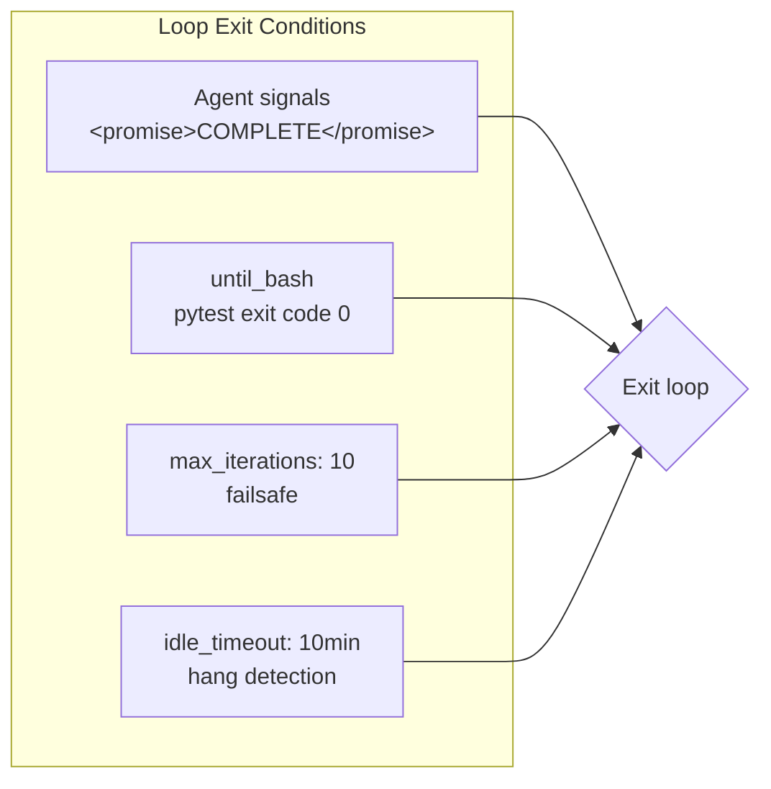

# Dev Pipeline Workflow

## Overview

```mermaid
flowchart TD
    START([Start: archon workflow run dev-pipeline]) --> PF

    PF["/preflight<br/>bash node"]
    PF -->|PASS| R
    PF -->|FAIL| STOP([Workflow stops])

    R["/research<br/>codegraph queries + nlm CLI<br/>+ context7 MCP"]
    R --> P

    P["/plan<br/>Read plan_local template<br/>Write plan file directly"]
    P --> DC

    subgraph IMPL_LOOP ["Implementation Loop (max 10 iterations)"]
        direction TB
        I["Step 4: IMPLEMENT<br/>Execute plan tasks<br/>Validate after each change"]
        I --> RV
        RV["Step 5: REVIEW<br/>code-reviewer agent<br/>+ codegraph arch-check<br/>+ dead-code check"]
        RV -->|issues found| FIX["Fix issues"]
        FIX --> RV
        RV -->|clean| C
        C["Step 6: COMMIT<br/>Conventional commit<br/>+ Co-Authored-By"]
        C --> CR
        CR["Step 7: CRITIQUE<br/>Verify acceptance criteria<br/>+ codegraph structural checks"]
        CR -->|FAIL: gaps found| I
    end

    DC{dev-cycle<br/>loop node} --> IMPL_LOOP
    IMPL_LOOP -->|"CYCLE_COMPLETE<br/>+ until_bash passes"| RM

    RM["/roadmap<br/>Update ROADMAP.md"]
    RM --> PK

    PK["/package<br/>Bump version + build + PyPI"]
    PK --> TC

    subgraph TEST_LOOP ["Test Loop (max 10 iterations)"]
        direction TB
        T1["Stage 1: Unit tests<br/>pytest + compileall"]
        T1 --> T2
        T2["Stage 2: Install test<br/>Fresh venv + pip install"]
        T2 --> T3
        T3["Stage 3: Self-index<br/>codegraph index on itself"]
        T3 --> T4
        T4["Stage 4: Leytongo<br/>Real-world TS project"]
        T4 --> T5
        T5["Stage 5: Arch check<br/>codegraph arch-check"]
        T5 -->|any failure| TFIX["Fix + re-package"]
        TFIX --> T1
    end

    TC{test-cycle<br/>loop node} --> TEST_LOOP
    TEST_LOOP -->|"TESTS_PASS<br/>+ until_bash passes"| FI

    FI["/file-issues<br/>Create GitHub issues for<br/>out-of-scope discoveries"]
    FI --> PR

    PR["/create-pr<br/>feature → hotfix<br/>with PyPI version link"]
    PR --> DONE([Done])

    style PF fill:#2d5016,color:#fff
    style STOP fill:#8b0000,color:#fff
    style DONE fill:#2d5016,color:#fff
    style DC fill:#1a3a5c,color:#fff
    style TC fill:#1a3a5c,color:#fff
    style CR fill:#5c3a1a,color:#fff
    style T5 fill:#5c3a1a,color:#fff
    style IMPL_LOOP fill:#0d1b2a11,stroke:#1a3a5c,stroke-width:2px
    style TEST_LOOP fill:#0d1b2a11,stroke:#1a3a5c,stroke-width:2px
```

## Safety Mechanisms

## Node Details

| Step | Node ID | Type | Model | Key Tools |
|------|---------|------|-------|-----------|
| 0 | `preflight` | bash | - | docker, pytest, codegraph |
| 1-2 | `research` | prompt | opus | gh, codegraph CLI, nlm CLI, context7 |
| 3 | `plan` | prompt | opus | Read, Write (plan file) |
| 4-7 | `dev-cycle` | loop | opus | All tools, code-reviewer agent |
| 8 | `roadmap` | prompt | sonnet | Read, Edit |
| 9 | `package` | prompt | sonnet | build, twine, curl |
| 10 | `test-cycle` | loop | opus | pytest, codegraph, pip |
| 11 | `file-issues` | prompt | sonnet | gh issue create |
| 12 | `create-pr` | prompt | sonnet | gh pr create |
