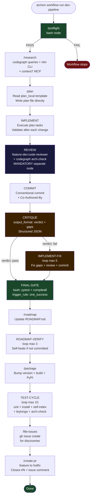

# Dev Pipeline Workflow

## Overview

```mermaid
flowchart TD
    START([archon workflow run dev-pipeline]) --> PF

    PF["/preflight<br/>bash node"]
    PF -->|PASS| R
    PF -->|FAIL| STOP([Workflow stops])

    R["/research<br/>codegraph queries + nlm CLI<br/>+ context7 MCP"]
    R --> P

    P["/plan<br/>Read plan_local template<br/>Write plan file directly"]
    P --> I

    I["IMPLEMENT<br/>Execute plan tasks<br/>Validate after each change"]
    I --> RV

    RV["REVIEW<br/>feature-dev:code-reviewer<br/>+ codegraph arch-check<br/>MANDATORY separate node"]
    RV --> CM

    CM["COMMIT<br/>Conventional commit<br/>+ Co-Authored-By"]
    CM --> CR

    CR["CRITIQUE<br/>output_format: verdict + gaps<br/>Structured JSON"]
    CR -->|"verdict: pass"| FG
    CR -->|"verdict: fail"| IF

    IF["IMPLEMENT-FIX<br/>loop max 5<br/>Fix gaps + review + commit"]
    IF --> FG

    FG["FINAL-GATE<br/>bash: pytest + compileall<br/>trigger_rule: one_success"]
    FG --> RM

    RM["/roadmap<br/>Update ROADMAP.md"]
    RM --> RMV

    RMV["ROADMAP-VERIFY<br/>loop max 3<br/>Self-heals if not committed"]
    RMV --> PK

    PK["/package<br/>Bump version + build + PyPI"]
    PK --> TC

    TC["TEST-CYCLE<br/>loop max 10<br/>unit + install + self-index<br/>+ leytongo + arch-check"]
    TC --> FI

    FI["/file-issues<br/>gh issue create<br/>for discoveries"]
    FI --> PR

    PR["/create-pr<br/>feature to hotfix<br/>Closes #N + issue comment"]
    PR --> DONE([Done])

    style PF fill:#1a472a,color:#fff
    style STOP fill:#6e1212,color:#fff
    style DONE fill:#1a472a,color:#fff
    style RV fill:#1a1a3d,color:#fff
    style CR fill:#3d2200,color:#fff
    style IF fill:#3d2200,color:#fff
    style FG fill:#1a472a,color:#fff
```
